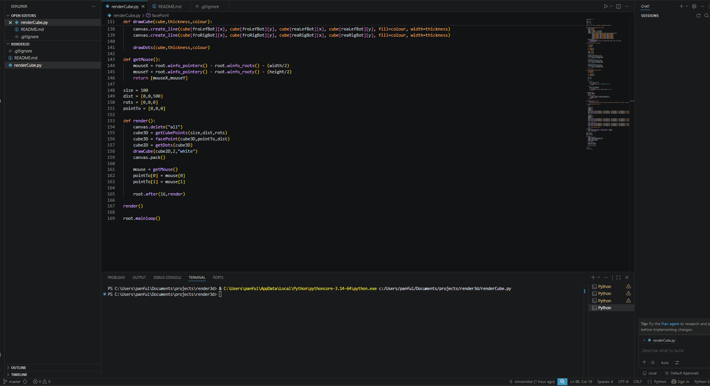

# Barebones 3D Graphics Rendering Demonstration
Renders a 3D object from scratch using just native python. I made it my mission to do this by formulating all the math myself as a personal project. As such, there may be more efficient formulas to be used, but what I've made here myself works. The code is a little messy since I haven't implemented OOP yet.

## How It Works
- Uses trigonometry to render 3d objects from scratch in a simple python-native script with `tkinter`. Understanding it is a good way to get a grasp on how advanced visual renders work under the hood, at a very primitive level.
- Only basic wireframe cubes have been integrated as a conventient creation funtion `getCubePoints()`. Crafting models through plotting each individual point is very tedious.
- The camera is at 90 degrees of FOV. Objects will experience some degree of FOV warping from the camera, this is normal.

## Setup
1. Clone the repository.
2. Set up the `render` function as desired.
3. Run python `main.py`.

